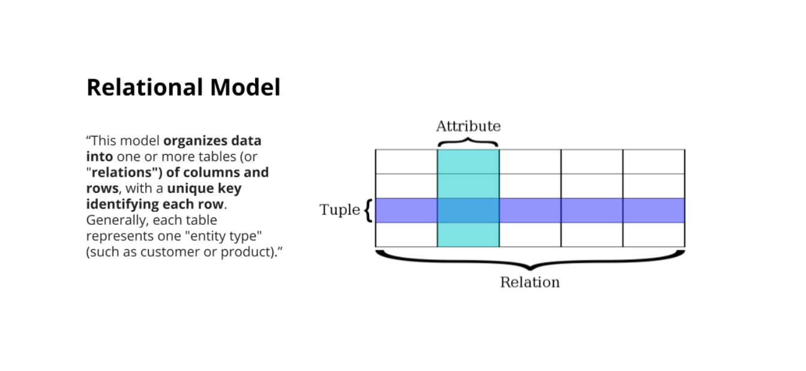
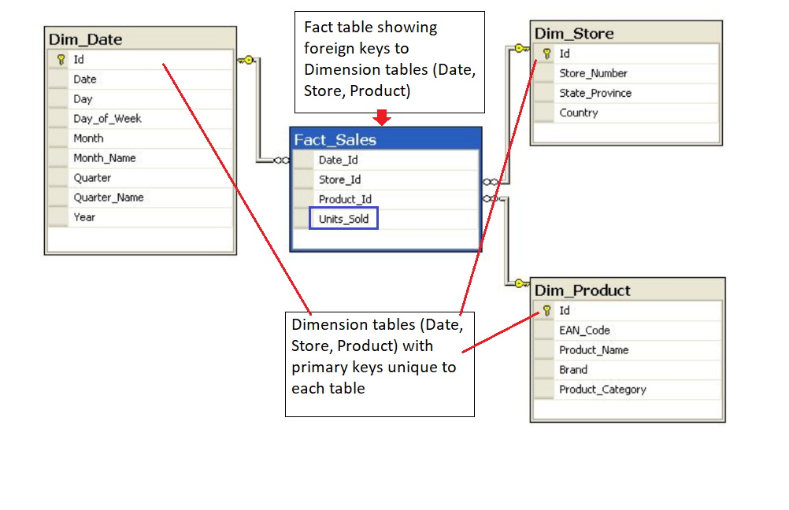
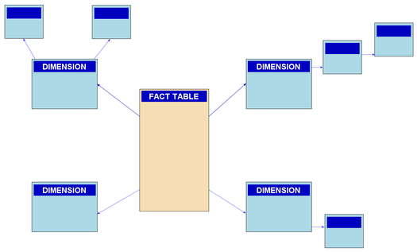

# **Data Engineering** 
**Chu Quang Nguyễn Hoàng**

## **Lesson1: Introduction to Data Modeling**


1. **Introduction to the Course:**

    You'll learn the concepts:

    - What is data model
    - Properties of relational and NoSQL database
    - How to create relational data models
    - How to create NoSQL data models

    **Prerequisites**:
    - Intermediate SQL skills
    - Intermediate Python programming skills

    **Lesson Overview**:
    - Data modeling for relational and NoSQL databases
    - An introduction to data modeling for NoSQL databases with Apache Cassandra
    - An introductiom to data modeling for NoSQL databases with Apache Cassandra

    Introduction to Databases and DBMS:
    - **Databases**: A [database](https://en.wikipedia.org/wiki/Database) is a structured repository or collection of data that is stored and retrieved electronically for use in applications. Data can be stored, updated, or deleted from a database
    - **Database Management System (DBMS)**: The software used to access the database by the user and application is the database management system. Check out these few links describing a DBMS in more detail.

        1. [Introduction to DBMS](https://www.geeksforgeeks.org/introduction-of-dbms-database-management-system-set-1/)
        2. [DBMS as per Wikipedia](https://en.wikipedia.org/wiki/Database#Database_management_system)
2. **What is Data Modeling?**

    What is a **Data Model**?
        
    >"... an abstraction that **organizes elements of data** and **how they** will **will relate** to each other" __Wikipedia

    >"The **process of creating data models** for an information system" __Wikipedia

    Data modeling can easily translate to database modeling, as this is the essential **end state**. 

    The process of data modeling is to organize  data into a database system to **ensure your data** is **persisted** and **easily usable** by you in your organization.

    This course will focus on The **pyshical data model** to **create Data Definition Language (DDL)**'s in **Relational** and **Non-relational** databases

    Data modeling as the the process of designing data and making it available to machine learning engineers, data scientists, business anlytics, etc,..

    Order of the Data Modeling Process:
        > Conceptual -> Logical -> Physical
3. **Why is Data Modeling is Important**?

    - Key points about Data Modeling:
        - Data Organization: extremely important
        -  Organized data determines later data use
        -  Early Start: Thinking and planning
        -  Iterative process
4. **Who does this type of work:**
    - Data Engineers
    - Data Sciencetists
    - Software Engineers
    - Product Owners
    - Business Users 
5. **Introduction to Relational Databases**
    
    There are two types of Databases: 
    - **Relational Databases** and **Non-relational Databases**

    1. **Relational Model**:
        > "This model **oprganizes data into** one or more tables ( or **"relation"**) **of columns and rows**, with a **unique key identifying each row**. Generaally, each table represents one "entity type" (such as customer or product)."

        

        Invented by IBM Edgar Codd(1970):
        > " ... is a digital database **based on the relational model** of data... a data software system to maintain relational databases is a realtional database management system (RDBMS)." __Wikipedia

        > "SQL (Structured Query Language) is the language used across almost all realtional database system fro querying and maintaining the database" __Wikipedia

        Examples of RDBMS include:
        - Oracle
        - Teradata
        - Mysql
        - PostgreSQL
        - Sqlite
        - Microsoft SQL Server
6. **Relational Database Quizzes:**

    1. **Question 1** of 3: True or False: A column holds multiple tables:
        
        a. [ _ ]. True 

        b. [ X ]. False

    2. **Question 2** of 3: True or False: An attribute is another name for a column.
        
        a. [ X ]. True
    
        b. [ _ ]. False
    3. **Question 3** of 3: True or False: A schema is a collection of tables in some database terminology
        
        a. [ X ]. True
        
        b. [ _ ]. False
7. **Advantages of using a Relational Database**
    - **Flexibility for writing in SQL queries**: with SQL being the most common database query language
    - **Modeling the data not modeling queries**
    - **Ability to do JOINS**
    - **Ability to aggregations and analytics**
    - **Secondary Indexes available**: Having the advantage of being able to add another index to help with quick searching
    - **Secondary Indexes available**
    - **Smaller data volumes**: If you have a smaller data volume (and not big data) you can use a realtional database for its simplicity.
    - **ACID Transactions**: Allow you to meet a set of properties of database transactions intended to guarantee validity even in the event of errors, power failures, and thus maintain data intergrity.
    - **Easier to change to business requirements**
8. **ACID Transactions**:

    1. **Definition**:
        - ACID Properties:
            > "...properties of database transactions intended to **guaranteee validity** even in the event of errors, power failures..." __Wikipedia
        - ACID stands for **A**tomicity, **C**onsistency, **I**solation, **Durability**
    2. **Properties**:
        -  **Atomicity** :
            >"... the whole transaction is processed or nothing is processed" __Wikipedia
        - **Consistency**:
            >"...only transactions that abide by constraints and rules is written into the database otherwise database keeps previous state" __Wikipedia
        - **Isolation**:
            >" Transactions are processed independently and securely, order does not matter. A low level of isolation enables many users to access data simultanously, however this also increases the possibilities of concurrency effects(eg. dirty reads, or lost updates". On the other hand, a high lvel of isolation reduces these chances of concurrency effects, but also uses more system resources and transactions blocking each other" __Wikipedia
        - **Duarability**:
            >" Completed transactions are saved to database even in cases of system failure. A commonly cited example includes tracking flight seat bookings. So once the flight booking records a confirmed seat booking, the seat remains booked even if a system failure occurs" __Wikipedia
        
    **Quesiton 1** of 2 : Which of these benefits of a relational database ?
        a. [ X ] ACID Transactions.
        b. [ X ] Abilities to do JOINS
        c. [ _ ] Can handle big data
        d. [ X ] Easy to change business requirements on the data        
    **Quesiton 2** of 2 : Can you JOIN a table with another table on any column ?
        a. [ X ] Yes, as long as there are matching values in the column.
        b. [ _ ] No, only on columns with the same name.
        c. [ _ ] Yes, you can join any columns together.
        d. [ _ ] No, only columns in the same table.
9. **When Not to Use a Relational Database**
    - **Have large ammount of data**
    - **Need to be able to store different data type formats**
    - **Need high throughput -- fast reads**:
        - While ACID transactions bring benefits, it also slows down the reading and writing process of the data. In case need very fast reads and writes, Relational Databases is **not** commonly **considered**
    - **Need a flexible schema**:
        - Flexible schema can allow for collumns to be added that do not have to be usedby every rơ, saving disk space.
    - **Need high avaibility**:
        - The Relational Database is not distributed. When that database goes down, a fail-over to a back up system occurs and takes time.
    - **Need horizontal scalability**
10. **Introduction to PostgreSQL**:
    
    Postgre SQL is an open-source object-relational database system.
    - PostgreSQL provides various features that reliabilty store and sclae complicated data workloads
    - PostgreSQL, SQL syntax is different than other realtional databases SQL syntax,
    
    note: [About PostgreSQL](https://www.postgresql.org/about/)
11. **11to 13: excercise 1**
13. **excercise**
12. **excercise**
14. **NoSQL Databases**

    >"...has a simpler design, simpler horizontal scaling, and finer control of avaibility. Data structures used are different than those in Relational Database are make some operarions faster."__Wikipedia
    - NoSQL = Not Only SQL; NoSQL and NonRelational are interchangeable terms.
    - Various types of NoSQL databases
    - Some common types of NoSQL Databases:
        - Apache Cassandra (Partition Row store)
        - MongoDB (Document store)
        - DynamoDB (Key-Value store)
        - Apache HBase (Wide Column Store)
        - Neo4j (Graph Database)
    - In this course, we will concentrate in Apache Cassandra to explain the concepts of data modeling for NoSQL Databases
    - The Basics of Apache Cassandra
        - Keyspace
            - Collection of Tables
        - Table
            - A group of partitions
        - Rows
            - A single items
        - Partition
            - Fundamental unit of access
            - Collection of row(s)
            - How data is distributed
        - Primary Key
            - Primary key is made up of a partition key and clustering columns
        - Columns
            - Clusteing and Data
            - Labeled element.
            
            
        
    **Question 1** of 2: True or False: A Keyspace in Apache Cassandra is similiar to a schema in PostgreSQL
        a. [ X ]. True            
        b. [ _ ]. False

    **Question 2** of 2: True or False: Which of these are examples of non-relational databases?
        a. [ _ ]. SQL
        b. [ X ]. Apache Cassandra
        c. [ _ ]. RDBMS
        d. [ X ]. MongoDB
15. **What is Apache Cassandra?**
    
    >"provides scability and high avaibility with out compromising performance. Linear Scalability and proven fault-tolerance on commodity hardware or cloud infrastructure make it perfect platform for mission-critcal data" __Apache Cassandra Documentation

    - There are a lots of clients (company) is using Apache Cassandra nowsaday, for short examples, we have Netflix uses Apache Cassandra to serve all their video to customers. Some good cases for No SQL are:
        1. Transaction logging (retail, health care)
        2. Internet of Thing (IoT)
        3. TIme series
        4. Any workload that is heavy on writes to the database(since Apache Cassandra is optimized for writes)
    
    **Quiz question**: When should you use a NoSQL database?
        a. [ X ]. Large Amounts of data
        b. [ _ ]. Need to be able to aggregations
        c. [ X ]. Need high availability
        d. [ X ]. You need to be able to scale out quickly
        e. [ _ ]. Need to be able to join multiple tables
16. **When to Use a NoSQL Database**    
    1. Large amounts of data
    2. Need horizontal scability
    3. Need high throughput -- fast reads
    4. Need a flexible schema
    5. Need high availability
    6. Need to be able to store different data type formats
    7. Users are distributed -- low latency
17. **When NOT to use a NoSQL Database?**
    1. Have a small dataset
    2. Need ACID Transactions
    3. Need ability to do JOINS
    4. Need ability to aggregations and analytics
    5. Have changing business requirements
    6. Queries are not available and need to have flexibility

    **Remember**:
    - NoSQL databases and Relational Databases do **not replace** each other for all tasks.
    - Both do different tasks extremely well, and should be utilized for the use cases they fit best.
18. **Demo 2**
19. **Exercise 2**
20. **Solution for excercise 2**
21. **Conclusion**
    - What we'd learnt:
        1. What is Data Modeling
        2. Stakeholders involved in Data Modeling
        3. When to use Relational Databases
        4. When not to use Relational Databases
        5. When to use NoSQL Databases
        6. When not to use NoSQL Databases
        7. How to create tables and insert data into PostgreSQL
        8. How to create tables and insert data into Apache Cassandra

## **Lesson2: Relational Data Models**

### **1. Lesson Overview**
- This lesson will show us how to do Relational Data Modeling by focusing on:
    1. Normalization
    2. Denormalization
    3. Fact/dimension tables
    4. Different schema models

### **2. Databases**
- **Database**: A set of related data and the way it is organized
- **Database Management System**: 
    > "...consisting of computer software that allows users to interact with the databases and provides access to all of the data. Because of the **close relationship** the term database is often used to refer to both the database and the DBMS used" __Wikipedia
- The term database is often used to refer to both the database and the DBMS used.
- More information on Codd's 12 Rules can be found here: [Codd's 12 Rules](https://en.wikipedia.org/wiki/Codd%27s_12_rules)
### **3. The Importance of Relational Databases**
- There are 12 rules was invented by Edgar R. Codd in 1969, proposing 12 rules of what makes a database management system a true relational system
- But in this course, we will just focus on **Rule 1** (first rule is Rule 0).
    - **Rule 1**: The *information rule*
    All information in a relational database is represented explicity at the logical level and in exactly one way - by values in tables
    - Why it is important:
        1. <ins>Standardization of data model</ins>
        2. <ins>Flexibility in adding and altering tables</ins>
        3. <ins>Data Integrity</ins>
        4. <ins>Structured Query Language (SQL)</ins>
        5. <ins>Simplicity</ins>
        5. <ins>Intuitive Organization</ins>
### **4. What is OLAP vs OLTP**
- <u>**Oneline Analytical Processing (OLAP)**</u>:
- Databases optimized for these workfloads allow for **complex analytical and ad hoc queries**. These type of databases are optimized for reads.
- <u>**Online Transactional Processing (OLTP)**</u>:
- Databases optimized for these workloads allow for **less complex queries in large volume**. The types of queries for these databases are read, insert, update, and delete
- Additional Resources on the difference between OLTP and OLAP:
    - this [Stackoverflow post](https://stackoverflow.com/questions/21900185/what-are-oltp-and-olap-what-is-the-difference-between-them) describes it well
    - "OLTP queries will have little aggregation really, if any, while OLAP will heavily focus on aggregations."
### **5. Quiz 1**
- **Question 1** of 2: True or False: OLTP queries are read heavy and focus primarily on analytics
    [ _ ]. True
    [ X ]. False
- **Question 2** of 2: What makes data modeling for relational databases different?
    [ X ]. The ability to model data in a way that is intuitive
    [ _ ]. You must model for your queries first
    [ _ ]. There is no flexibility or agile nature to this process
### **6. Structuring the Database: Nor and Denor**
- **Normalization:** To reduce data rendundancy and increase data integrity
- **Denormalization** Must be done in read heavily workloads to increase performance
### **7. Objectives of Normal Form**
1. To free the database from unwanted insertions, updates & deletion dependencies
2. To reduce the need for refactoring the database as new types of data are introduced
3. To make the relational model more informatiuve to users
4. To make the database neutral to the query statistics
### **8. Normal Forms**
1. **How to reach First Normal Form(1NF)**
    - Atomic value: each cell contains unique and single values
    - Be able to add data without altering tables
    - Seperate different relations into different tables
    - Keep relationships between tables together with foreign keys

2. **Second Normal Form (2NF):**
- Have reached 1NF
- All column in the tabe must rely on the Primary Key

3. **Third Normal Form(3NF):**
- Must be in 2nd Normal Form
- No transitive dependencies
- Remember, transitive dependencies you are trying to maintain is that to get from A->C, you want to avoid going through B

4. **Note**:
    - When you wan to update data, we want to be able to do in just 1 place. We want to avoid updating the table in the Customer Detail table (in the example in the lecture slide).
    
    - Difference betwwen **Primary Key** and **Foreign Key**:
        1. **Primary Key**:
            - A primary key is used to ensure data in the specific columns is unique.
            - It uniquely identities a record in the relational database table.
            - Only one primary key is allowed in a table.
            - It is a combination of UNIQUE and Not Null constraints
            - It does not allow NULL values
            - Its value cannot be deleted from the parent table.
            - It constraint can be implicity defined on the temporary tables
        2. **Foreign Key**:
            - Foreign Key is a column or group of columns in a realtional database table that provides a link between data in two tables
            - It refers to the field in a table which is the primary key of another table
            - Whereas more than one foreign key are allowed in a table
            - It can contain duplicate values and a table in a relational database
            - It can also contain NULL values
            - Its value can be deleted from the child table
            - It constraint cannot be defined on the local or global temporary tables
5. **Quiz Question**
    1. What is the maximum normal form that should be attempted while doing pratical data modeling?
    [ _ ]. First normal form
    [ _ ]. Second normal form
    [ X ]. Third normal form
    [ _ ]. Fourth normal form
### **9. Demo1: Creating Noramlized Tables**
### **10. Excercise 1: Creating Normalized Tables**
### **11. Solution**
### **12. Denormalization**
1. **Definition:**
    - Denormalization:
        > The process of trying to improve the read performance of a database at the expense of losing some write performance by adding redundant copies of data.
        - JOINS on the database allow for outstanding flexibility but <u>**extremely slow**</u>. If you are dealing with heavy reads on your database, you may want to think about denormalization your tables.
        - First, you need to get your data into Normalization form, and then you proceed with denormalization. That means denormalization <u>**comes after**</u> normalization.
        - Citation : [Denormalization](https://en.wikipedia.org/wiki/Denormalization)
    - **Quiz question**: True or False: Denormalization is just allowing daa to come as it is with no organization or planning:
    [ _ ]. True
    [ X ]. False
### **13. Demo2: Creating Denormalized Tables** 
### **14. Denormalization VS Normalization**
- **Normalization** is about tryuing to increase data intergrity by reducing the number of copies of the data. Data that need to be added or updated will be done is as few places as possible.
- **Denormalization** is trying to increase preformance by reducing number of joins between tables (as joins can be slow). Data integrity will take a bit of potential hit, as there will be more copies of the data (to reduce JOINS)
### **15. Excercise 2: Creating Denormalized Tables**
### **16. Solution: Excercise 2: Creating Denormalized Tables**
### **17. Fact and Dimension Tables**:
- __Fact and Dimension Tables__:
    - Work together to create an organized data model
    - While fact and dimentsion are not created differentlly in the DDL, they are conceptual and extremely important for organization
- __Fact Tables__: 
    - Fact Table consists of the measurements, metrics or facts of a business process.
    - Fact tables are made up of facts
    - Fact tables can be aggregations of data, but __are not__ meant to be updated inplace like dimension table would. Normally have ints or numbers
- __Dimension Tables__:
    - A structure that categorizes facts and measures in order to enable users answer business questions. Dimensions are people, products, place and time
    - Are all the other pieces of information that are not incuded in the fact table.
    - Each dimenstion table will have one or more fact tables joined together with a foreign key.<br>


### __18. Star Schemas__:
- __Star Schemas__:
    - Star Schema is the simplest style of data mart schema. The star schema consists of one of more fact tables referencing any number of dimension tables
        - Gets its name from the physical model resembling a star shape
        - A fact table is at its center
        - Dimension table surrounds the fact table representing the star's points
    - __Additonal Resources__:
        Checkout this Wikipedia page on [Star schemas](https://en.wikipedia.org/wiki/Star_schema)
### __19. Benefits of Star Schemas__:
|__Benefits__                             |__Drawbacks__                            |
|:----------------------------------------|----------------------------------------:|
|1. Denormalized                          |1. Issues that come with<br> denormalized|
|2. Simpifies queires                     |2. Data Integrity                        |
|3. Fast aggregations                     |3. Decrease query flexibity              |
|                                         |4. May to many relationship<br>--simplied|


### __20. Snowflake Schema__:
- __Snowflake Schemas__:
    - Logical arrangement of tables in a multidimensional data base represented by centralized fact tables which are connected to multiple dimensions.
- __why "snowfake" schema? :__
    - " A complex snowflake shape emerges when the dimensions of a snowflake are elaborated, having multiple levels of relationships, child tables having multiple parents."
    <br>
- __Snowflake vs Star:__
    - Star Schema is a special, simplified case of the snowflake schema.
    - Star Schema doesn't allow for one to many relationships, while the snowflake schema does.
    - Snowflake schema is more normalized than Star schema but only in 1NF or 2NF
### __21. Demo 3: Creating Fact and Dimension Tables___
### __22. Excercise 3: Creating Fact and Dimension Tables__
### __23. Solution: Excercise 3: Creating Fact and Dimension Tables__
### __24. Data Definition and Constraints__
1. __NOT NULL__:
    The __NOT NULL__ constraints indicates that the column cannot ontain a null value.
    Here is the syntax for adding a NOT NULL constraint to the CREATE statement:
    ```
    CREATE TABLE IF NOT EXIST customer_transactions (
        customer_id int NOT NULL,
        store_id int, spent_numeric
    );
    ```
    You can add __NOT NULL__ constraints to more than one column. Usually this occurs when you have a __COMPOSITE KEY__, which will be discussed further below
    Here is the syntax for it:
    ```
    CREATE TABLE IF NOT EXISTS customer_transactions (
        customer_id int NOT NULL,
        store_id int NOT NULL,
        spent numeric
    );
    ```
2. __UNIQUE__:
    The __UNIQUE__ constraint is used to specify that the data across all the rows in one column are unique within the table. The __UNIQUE__ constraint can also be used for multiple columns, so that the combination of the values across those columns will be unique within the table. In this latter case, the values within 1 column do not need to be unique.
    Let's look at an example.
    ```
    CREATE TABLE IF NOT EXISTS customer_transactions (
        customer_id int NOT NULL UNIQUE,
        store_id int NOT NULL UNIQUE,
        spent numberic
    );
    ```
    Another way to write a __UNIQUE__ constraint is to add a table using commas to seperate the columns.
    ```
    CREATE TABLE IF NOT EXISTS customer_transactions (
        customer_id int NOT NULL,
        store_id int NOT NULL,
        spent numeric,
        UNIQUE (customer_id, store_id, spent)
    );
    ```
3. __PRIMARY KEY__
    The __PRIMARY KEY__ constraint is defined on a single column, and <u>every table should contain a primary key</u>. They values in this column uniqeuly identify the rows in the table. If a group of columns are defined as a primary key, the are called a composite key. That meansthe combination of values in these columns will uniquely identify the rows in the table. By default. the __PRIMARY KEY__ constraint has the unique and not null constraint built into it.
    Let's look at the following example:
    ```py
    CREATE TABLE IOF NOT EXISTS store (
        store_id int  PRIMARY KEY,
        store_location_city text,
        store_location_state text
    );
    ```
    Here is an example for a group of columns serving as __composite key__ 
    ```py
    CREATE TABLE IF NOT EXISTS customer_transactions (
        customer_id int,
        store_id int,
        spent numeric,
        PRIMARY KEY (customer_id, store_id)
    );
    ```
### 25. __UPSERT__
1. __UPSERT__
    In RDBMS language, the term upsert refers to the idea inserting a new eow in an existing table, or updating the row if it already exists in the table. The action of updating or inserting has been described as "upsert".
    The way this is handled in PostgreSQL is by using the `INSERT` statement in combination with the `ON CONFLICT` clause.
2. __INSERT__
    The __INSERT__ statement adds in new rows within the table. The values associated with specific target columns can be added in any order.
    Let's look at a simple example below:
    ```py
    CRATE TABLE IF NOT EXISTS customer_adress (
        customer_id int PRIMARY KEY,
        customer_street varchar NOT NULL,
        customer_city text NOT NULL,
        customer_state text NOT NULL
    );
    ```
    Let's try to insert data into it by adding a new row:
    ```py
    INSERT into customer_address (
        VALUES
            (432, '758 Main Street', 'Chicago', 'IL')
    );
    ```
    Now let's assume that the customer moced and we need to update the customer's adrdress. However we do not want to add a new customer id. In other words, if there is any conflict on the `customer_id`, we do not want that to change
    This would be a good candidate for using the __ON CONFLICT DO NOTHING__ clause.
    ```py
    INSERT INTO customer_adress (customer_id, customer_street, customer_city, customer_state)
    VALUES
        (
            432, '932 Knox Street', 'Albany', 'NY'
        )
    ON CONFLICT (customer_id)
    DO NOTHING;
    ```
    Now, let's imagine we want to add more details in the existing address for an existing customer. This would be a good candidate for using the __ON CONFLICT DO UPDATE__ clause.
    ```py
    INSERT INTO customer_adress (customer_id, customer_street)
    VALUES
        (
            432, '923 Knox Street Suite 1'
        )
    ON CONFLICT (customer_id)
    DO UPDATE
        SET customer_street = EXCLUDED.customer_street;
    ```
    __NOTE__: on the example above, the line:
    ```py
        SET customer_street = EXCLUDED.customer_street
    ```
    is used when you just want to update one part (element) on this row without damage to other elements. You can compare with __ON CONFLICT DO NOTHING__ above.
    26. __Conclusion__:
    What we learned:
        - What makes a database a relational database and Codd's 12 rules of relational database design
        - The difference between different types of workloads for databases OLAP and OLTP
        - The process of database normalization and the normal forms.
        - Denormalization and when it should be used.
        Fact and dimension tables as a concept and how to apply that to our data modeling
        - How the star and snowflake schemas use the concepts of fact and dimension tables to make getting value out of the data easier.
## __Lesson 3: Data Modeling with PostGres__
### __1. Introduction__:
A startup called Sparkify wants to analyze the data they've been collecting on songs and user activity on their new music streaming app. The analytics team is particularly interested in understanding what songs users are listening to. Currently, they don't have an easy way to query their data, which resides in a directory of JSON logs on user activity on the app, as well as a directory with JSON metadata on the songs in their app.

They'd like a data engineer to create a Postgres database with tables designed to optimize queries on song play analysis, and bring you on the project. Your role is to create a database schema and ETL pipeline for this analysis. You'll be able to test your database and ETL pipeline by running queries given to you by the analytics team from Sparkify and compare your results with their expected results.
- <u>__Project Description__</u>
    In this project, you'll apply what you've learned on data modeling with Postgres and build an ETL pipeline using python. To complete the project, you will need to define fact and dimension tables for a star schema for a particular analytic focus, and wrtie an ETL pipeline that tranfers data from files in two local directories into these tables in Postgres using Python and SQL.
### __2. Project Datasets__:
1. __Song Dataset__ :
    The first dataset is a subset pf real; data from the Million Song Dataset. Each file is in JSON format and contains metadata about a song and the artist of that song. The fies are partitioned by the forst three letters of each song's track ID. For example, here are file paths to two files in this dataset.
    > song_data/A/B/C/TRABCEI128F424C983.json
      song_data/A/A/B/TRAABJL12903CDCF1A.json

    And below is an example of what a single song file, `TRAABJL12903CDCF1A.json`, looks like.
    ```py
    {"num_songs": 1, "artist_id": "ARJIE2Y1187B994AB7", "artist_latitude": null, "artist_longitude": null, "artist_location": "", "artist_name": "Line Renaud", "song_id": "SOUPIRU12A6D4FA1E1", "title": "Der Kleine Dompfaff", "duration": 152.92036, "year": 0}
    ```
2. __Log Dataset__:
    The log files in the dataset you'll be working with are partitioned by year and month. For example, here are filepaths to two files in this dataset.
    > log_data/2018/11/2018-11-12-events.json
      log_data/2018/11/2018-11-13-events.json
### __3. Project Instructions__
#### __Schema for Song Play Analysis__
Using the song log datasets, you'll need to create a star schema optimized for queries on song play analysis. This includes the following tables.
##### __1. Fact Table__
1. __songplays__ - records in log data associated with song plays i.e. records with page `NextSong`
    - _songplay_id, start_time, user_id, level, song_od, artist_id, session, location, user_agent_
##### __2. Dimension Tables__
2. __users__ - users in the app
    - _user_id, first_name, last_name, gender, level_
3. __songs__ - songs in music database
    - _song_id, name, location, latitude, longtitude_
4. __artists__ - artists in music database
    - _artist_id, name, location, latitude, longtitude_
5. __time__ - timestamps of records in __songplays__ broken down into specific units
    - _start_time, hour, day, week, month, year, weekday_
__NOTE__: about [timestamp in PostgreSQL](https://www.postgresqltutorial.com/postgresql-tutorial/postgresql-timestamp/#:~:text=The%20timestamp%20datatype%20allows%20you,database%20will%20not%20change%20automatically.)
#### Project Template
In addition to the data files, the project workspace includes sex files:
1. `test.ipynb` displays the first few rows of each table to let you check your database.
2. `create_tables.py`drops and creates your tables. You run this file tp reset your tables before each time you run your ETL scripts.
3. `etl.ipynb` reads and processes a single from `song_data` and `log_data` and loads the data into your tables. This notebook contains detailed instructions on the ETL process for each of the tables.
4. `etl.py` reads and processes a single file from `song_data` and `log_data` and loads the data into your tables. This notebook contains detailed instructions on the ETL process for each of the tables You can fill this out based on your work in the ETL notebook.
5. `sql_queires.py` contains all your sql queries, and is improted into the last three files above.
6. `README.md` provides discussion on your project.
#### Project Steps
__NOTE__: you will not be able to run `test.ipynb`, `etl.ipynb`, or `etl.py` until you have run `create_tables.py`at least once to create the `sparckifydb` database, which these other files connect to.
Below are steps you can follow to complete the project:
##### __Create Tables__
1. Write `CREATE` statements in `sql_queries.py` to create each table.
2. Write `DROP` statements in `sql_queries.py` to drop each table if it exists.
3. Run `create_tables.py` to create your database and tables
4. Run `test.ipynb` to confirm the creation of your tables with the correct columns. Make sure to click "Restart kernel" to close the connection to the database after running this notebook.
##### __Build ETL Processes__
Follow instructions in the `etl.ipynb` notebook to develop ETL processes for each table. At the end of each table section, or at the end of the notebook, run `test.ipynb` to confirm that records were successfully inserted into each table. Remember to rerun `create_tables.py` to reset your tables before each time you run this notebook.
##### __Build ETL Pipeline__
Use what you've completed in `etl.ipynb` to complete `etl.py`, where you'll process the entire datasets. Remember to run `create_tables.py` before running `etl.py` to reset your tables. Run `test.ipynb` to confirm your records were successfully inserted into each table.
##### __Run Sanity Tests__
When you are satisfied with your workm run the cell under the __Sanity Tests__ section in the `test.ipynb` to confirm your records were successfully inserted into each table.
##### __Run Sanity Tests__
When you are satisfied with your work, run the cell under the Sanity Tests section in the test.ipynb notebook. The cells contain some basic tests that will evaluate your work and catch any silly mistakes. We test column data types, primary key constraints and not-null constraints as well look for on-conflict clauses wherever required. If any of the test cases catches a problem, you will see a warning message printed in Orange that looks like this:

> [WARNING] The songplays table does not have a primary key!

You may want to make appropriate changes to your code to make these warning messages go away. The tests below are only meant to help you make your work foolproof. The submission will still be graded by a human grader against the project rubric.

##### __Document Process__
1. Do the follwing steps in your `README.md` file
    - Discuss the purpose of this database in the context of the startup, Sparkify, and their analytical goals.
    - How to run the Python scripts
    - An explanation of the files in the repository
    - State and justify your database schema design and ETL pipeline.
    - [Optional] Provide example queries and results for song play analysis.
2. Provide `DOCSTRING` statement in each function implementation to descrive what each function does.

##### __Project Rubric__
Read the project [rubric](https://review.udacity.com/#!/rubrics/4792/view) before and during development of your project to ensure you meet all specifications.<br>
[JOINS](https://documentation.requirementyogi.com/display/SQL/Matching+records+from+two+tables+-+the+JOIN)
## __Lesson 4: No SQL__:
### 1. Non-Relational Databases:
- In this lesson, you'll learn the fundamentals of data modeling for NoSQL databases, focusing on:
    - Basics of NoSQL database design
    - Denormalization
    - Primary keys
    - Clustering columns
    - The WHERE clause
- You'll practice data modeling for NoSQL databases with Apache Cassandra
- In this lesson, we'll refer to non-relational databases as NoSQL databases. Historically, this did stand for NON-SQL, but NoSQL has come to mean **N**ot **O**nly SQL, as languages Cassandra Query language mimic SQL very closely.
### 2. Non-raltional Databases:
- <u>When to Use NoSQL</u>:
    - **Need high Availability in the data**: Indicates the system is always up and there is no downtime
    - **Have Large Amounts of Data**
    - **Need Linear Scalability:** The need to add more nodes to the system so performance will increase linearly
    - **Low Latency**: Shorter delay before the data is transferred once the instruction for the transfer has been received.
    - **Need fast reads and write**
- **Apache Cassandra**
    - Open Source NoSQL DB - go download the code!
    - Masterless Architecture
    - High Availability
    - Linearly Scalable
    - Used by Uber, Netflix, Hulu, Twitter, Facebook, etc
    - Major contributors to the project: Datasax, Facebook, Twiiter, Apple
### **3. Distributed Databases**
- **Distributed Databases**
    > In a **distributed database**, in order to have high availability, you will need **copies of you data**.
- **Envantual Consistency**
    > A consistency model used in distributed computing to achieve **high availability** that informally guarantess that, **if no new updates** are made to a given data item, eventually all accesses to that item will **return the last updated value**
    - Citation: [Wikipedia page](https://en.wikipedia.org/wiki/Eventual_consistency)
- **Apache Cassandra Data Architect:**
    - [Cassandra Architecture](https://www.tutorialspoint.com/cassandra/cassandra_architecture.htm)
- **Cassandra Documentation**:
    - [documentation](https://docs.datastax.com/en/archived/cassandra/3.0/cassandra/dml/dmlIntro.html)
### **4. CAP Theorem**
- **CAP THEOREM**:
    > A theorem in computer science that states it is **impossible** for a distributed data store to **simultaneously provide** more than two out of the following three guarantees of **consistency**, **availability**, and **partition tokerance.**
    - **Consistency**: Every read from the database gets the latest (and correct) piece of data or an error
    - **Availability**: Every request is received and a response is given -- without a guarantee that the data is the latest update
    - **Partition Tolerance:** The system continues to work regardless of losing network connectivity between nodes.
    - [Wikipedia page](https://en.wikipedia.org/wiki/CAP_theorem)
    - **Note**:
        - As the CAP Theorem Wikipedia entry says, "The CAP theorem implies that in the presence of a network partition, **one has to choose between consistency and availability**." So there is no such things as Consistency and Availability in a distributed database since it must always tolerate network issues. You can only have Consistancy and Partition Tolerance(AP). Remember, realtional and non-relational databases do different things, and that's why most companies have both types of database systems.
### 5. Quiz 1:
|**CAP Theorem Term**|**Definition**|
|:--------:|:---------:|
|Consistency|Database will get the latest piece of data requested|
|Availability|Every request is received and a response is given|
|Partition Tolerance|Network connectivity does not affect the system.|
**Apache Cassandra is..**
(Check all that apply)

[ X ] A Highly Availability Database
[ _ ] Linearly scalable
[ _ ] Used when ACID transacstions are needed
[ X ] An Open Source project supported by The Apache Foundation
[ _ ] A Conistency and Partition Tolerant Database during network failures
### 6. Denormalization in Apache Cassandra
- **Denormalization in Apache Cassandra**:
    > Denormalization of tables in Apache Cassandra in absolutely critical. The biggest take away when doing data modeling in Apache Cassandra is to think about your **queries** first. There are no "JOINS" in Apache Cassandra.